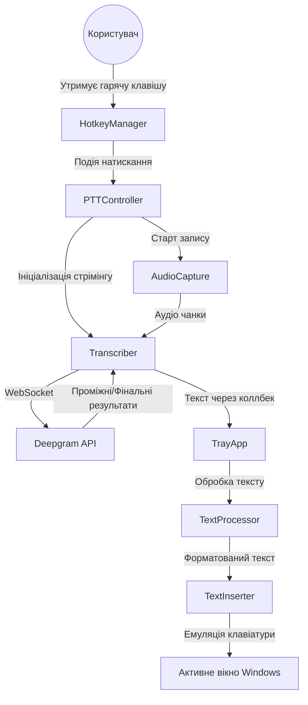

# 🧠 CORE.md — Технічна документація для AI-асистентів

Цей файл є основним джерелом знань про проєкт для AI-асистентів та розробників. Він містить повний опис архітектури, технологічного стека та логіки роботи додатка.

---

## 📋 Інформація про проєкт

**Назва**: CORE (раніше WispanTalk)
**Короткий опис**: Десктопний додаток для Windows, що забезпечує миттєву транскрипцію голосу в текст у будь-яке активне вікно за допомогою Deepgram API.
**Основна мова інтерфейсу**: Українська

---

## 🛠️ Технологічний стек
- **Backend/Logic**: Python 3.11+
- **STT Engine**: Deepgram API (Nova-2 модель)
- **GUI Framework**: PyQt6 (>= 6.6.0)
- **Audio Processing**: Sounddevice, NumPy, SciPy
- **System Integration**: 
  - `pynput`: Глобальні гарячі клавіші (Hotkeys)
  - `pyautogui`, `pyperclip`: Емуляція введення тексту
- **Logging**: Loguru
- **Build System**: PyInstaller (скрипт `build_exe.py`)

---

## 🏗️ Архітектура та логіка роботи

### Схема взаємодії (Mermaid)


### Основні архітектурні рішення
1.  **Подійно-орієнтована модель**: Додаток реагує на системні переривання (гарячі клавіші) через `pynput`.
2.  **WebSocket Streaming**: Для мінімізації затримки (latency) використовується потокова передача аудіо чанками по ~500мс.
3.  **Розділення відповідальності**:
    - `engine/`: Ядро обробки (STT, словники).
    - `input/`: Захоплення звуку та клавіатури.
    - `ui/`: Інтерфейс у треї та налаштування.
    - `output/`: Взаємодія з операційною системою для вставки тексту.

---

## 📂 Структура файлів проєкту

```text
src/
├── core.py                 # Вхідна точка додатка
├── engine/                 # Двигун транскрипції
│   ├── transcriber.py      # Міст до Deepgram SDK (Streaming/REST)
│   ├── text_processor.py   # Пост-обробка (пунктуація, капіталізація)
│   └── dictionary.py       # Користувацькі словники та автозаміна
├── input/                  # Введення даних
│   ├── audio_capture.py    # Захоплення звуку з мікрофона
│   ├── hotkey_manager.py   # Глобальні Hotkeys (pynput)
│   ├── ptt_controller.py   # Логіка Push-To-Talk
│   └── toggle_controller.py# Логіка Toggle (On/Off)
├── output/                 # Виведення даних
│   └── text_inserter.py    # Емуляція введення тексту (PyAutoGUI)
├── ui/                     # Інтерфейс (PyQt6)
│   ├── tray_app.py         # Головний клас додатка (Tray Icon)
│   ├── settings_dialog.py  # Вікно налаштувань
│   ├── overlay_widget.py   # Компактний індикатор запису
│   └── styles.py           # Сучасна темна QSS стилізація
└── utils/                  # Утиліти
    ├── constants.py        # Назви, версії, шляхи
    └── logger.py           # Конфігурація Loguru
```

---

## ⚙️ Змінні оточення та конфігурація (config.json)

Додаток використовує `config.json` у корені проєкту замість `.env` для зручності дистрибуції.

| Секція | Ключ | Опис | Дефолтне значення |
| :--- | :--- | :--- | :--- |
| `transcription` | `deepgram_api_key` | Ключ Deepgram (Обов'язково) | "" |
| `transcription` | `language` | Мова розпізнавання | "uk" |
| `hotkeys` | `push_to_talk` | Гаряча клавіша запису | "ctrl+space" |
| `audio` | `sample_rate` | Частота дискретизації | 16000 |
| `output` | `insert_method` | Метод вставки тексту | "clipboard" |

---

## 🚀 Як запустити та зібрати

### Локальний запуск (Development)
1. Встановити залежності: `pip install -r requirements.txt`
2. Налаштувати `config.json` (додати `deepgram_api_key`).
3. Запустити: `python src/core.py`

### Збірка в .exe
Запустити скрипт: `python build_exe.py`. 
Результат буде в папці `dist/CORE/CORE.exe`. Скрипт автоматично використовує `C:\Temp` для збірки, щоб уникнути помилок з кирилицею в шляхах.

---

## ⚠️ Важливі нюанси для розробників
- **Namespace Collision**: Файл `src/core.py` не може співіснувати з папкою `src/core/`. Тому папка перейменована в `src/engine/`.
- **Latency**: Для миттєвої вставки використовуйте `chunk_duration` ~0.5с.
- **GUI Thread**: PyQt6 GUI повинен працювати в головному потоці. STT та запис працюють у фонових потоках/воркерах.
- **API Key**: Без валідного ключа Deepgram транскрипція не працюватиме (Response 401).

---

## 🗺️ Roadmap / Заплановано
- [ ] Підтримка локальних моделей (Whisper) як фолбек.
- [ ] Розширене керування словниками через GUI.
- [x] Оптимізація використання пам'яті та стабільності при довгих сесіях (Session Guard, 1s Endpointing).
